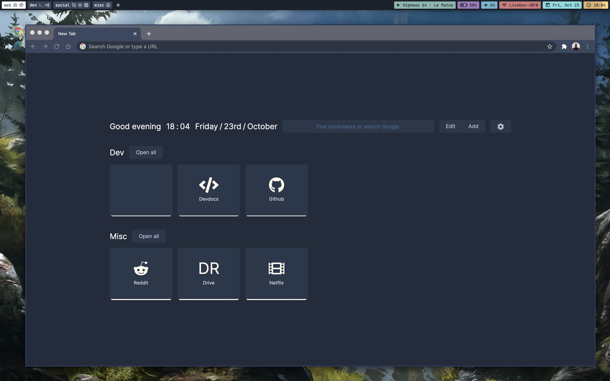

# Night shift (Desaturated) theme for Google Chrome

This is a port of my [Night Shift theme](https://github.com/Jean-Tinland/vscode-theme-desaturated) for Visual Studio Code.\
You'll find an iTerm2 color scheme [here](https://github.com/Jean-Tinland/iTerm2-theme-desaturated).

## Preview



## Installation

First, clone this repo.

```bash
$ git clone https://github.com/Jean-Tinland/chrome-theme-desaturated
```

Then go to `chrome://extensions/` and toggle 'Developer mode'.\
Click on 'Load unpacked' button and select the `chrome-theme-desaturated` directory.
